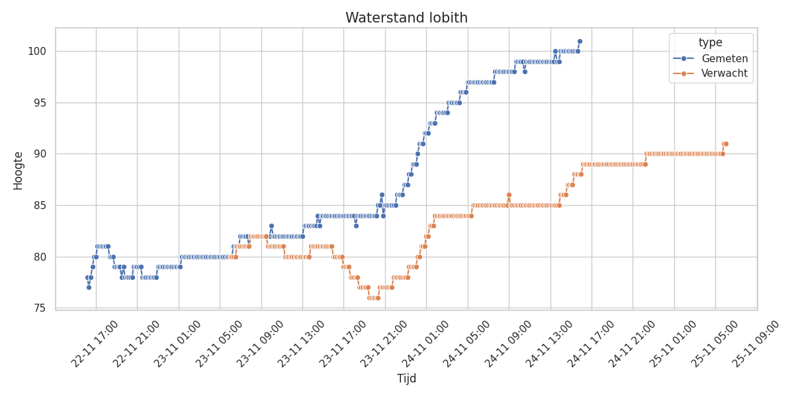

# waterstand
Ophalen van de actuele waterstand.

Gegevens komen van Rijkswaterstaat.

## Gebruik
Installeer de package:  
`pip install waterstand`  

Of zet waterstand in `requirements.txt` en installeer het op die manier.  
`pip install -r requirements.txt --upgrade`

Ga naar [de site van RWS](https://waterinfo.rws.nl/publiek/waterhoogte) en 
zoek daar een locatie waarvan je hoogte wilt ophalen. Wanneer je de locatie aanklikt 
en op meer details klikt, verschijnt in de adresbalk de naam van deze locatie.
Bijvoorbeeld voor Lobith staat er ...waterhoogte/lobith.bovenrijn.tolkamer/details...
in het pad.
Neem het voor de locatie het deel tussen de `waterhoogte/` en `/details`. In het
voorbeeld wordt dat dus `lobith.bovenrijn.tolkamer`.
Het meest eenvoudige programma wordt dan als volgt:
```Python
from waterstand import *
print(haalwaterstand('lobith.bovenrijn.tolkamer'))
```

Een PNG-afbeelding zoals hieronder kan gemaakt worden door een aanroep van `maakafbeelding()`
met dezelfde parameters als `haalwaterstand()`. 

